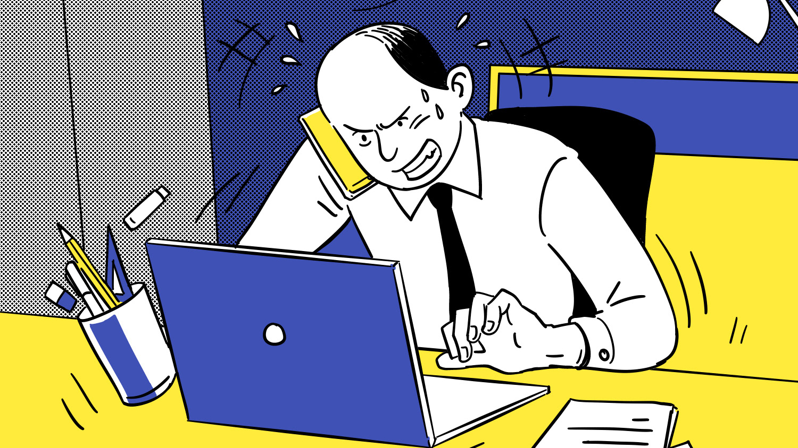

# Overwhelmed at work? Six tips on how to beat stress

_From saying ‘no’ to understanding what triggers your stress – our experts share advice on how to stop feeling overloaded._

> Considering changing jobs? Explore the range of vacancies on Guardian Jobs and find the perfect role for you

## Understand the triggers

When you are feeling overwhelmed at work, it is important find out why you feel that way. Do you have too many responsibilities, or feel there are too few hours in the day? Is your boss piling on the pressure? Or is the company culture getting you down?

“Feeling overwhelmed is actually a stress response when we feel the demand on us outweighs our resources,” says Diana Dawson, career psychologist and owner of Working Career. Feeling out of control and under pressure is a form of emotional overloading and can also trigger the release of stress hormones such as cortisol and adrenaline, she says.

Keeping a journal of thoughts, feelings and actions can help you identify what causes this reaction, she adds. “Once we understand what triggers the stress, we can perhaps understand why that is and we can build strategies around those things.”

### Don’t suffer in silence

If your workload is unmanageable, it’s a good idea to speak to your boss. This can be a daunting prospect, but making a plan before your discussion will help. Revisit your job description before the meeting. “Explain to your boss the tasks you are involved in, how long they take, the resources they require, why you find them challenging, and practical suggestions for a solution,” suggests Sarah Connell, a business psychologist and founder of MindingMe Psychologists.
Eight ways to eliminate stress at work
Read more

“Try to control your emotions in the meeting, remain calm and professional. Focus on concerns about quality to demonstrate you are still committed to doing a good job,” she says. “It is not a sign of weakness, asking for help, and your manager may not realise how much work you have on.”

David Webb, writer and editor at employment relations specialist Acas, says that if your boss is professional, you should get a positive reaction when raising the issue. “The situation may be because of a temporary factor you are unaware of, and they may be able to help in some way.” This is an ideal scenario, but unfortunately not always the case. “If a bad boss is putting extra work on you without caring, then that’s a more difficult situation,” he says. In these circumstances, it is worth speaking to a trade union or employee representative and look into the company’s grievance procedure.

## Learn to say no

The ability to say no “is probably my top tip for life as well as work,” says psychotherapist and life coach Hilda Burke. Often people who say yes to everything have this instilled in them in childhood, she explains, because they think if they do not obey rules they will be rejected. In a working environment people might think they are lucky to have a job, so it is best to keep their head down and not fuss, she says. “Challenging this type of work programming can take some time, but it can be done.”

Pushing back can particularly hard for freelancers, however, who often take on more than they can handle because of financial uncertainty. “I understand the temptation to say yes to new projects, but if it gets to a point where your existing projects or clients are suffering then it’s time to take stock,” says Burke.

She suggests buddying up with another freelancer or colleague that you trust to help with the workload. “Saying no shows your busy already, which can be a good message to give out,” she says.

> At times of intense work, it’s more important than ever to look after your physical and emotional self Hilda Burke, psychotherapist

### Put things into perspective

Changing the way you think about your work situation could help alleviate some of the pressure, says Connell. “Remember the important things in life and do not let yourself get carried away with stresses.” She suggests trying cognitive behavioural therapy and mindfulness techniques. “They cannot resolve the work situation, but instead are aimed at helping you manage how you think about it and how you cope from a personal perspective.”

When you are feeling stressed at work, you should leave this emotional baggage in the office. “Remember it’s just a job. Don’t take it home with you, switch off email and phone alerts when you’re at home and plan some fun stuff outside work,” says Sarah Archer, career coach and co-founder of CareerTree.

### Take breaks and relax

Feeling overwhelmed at work can send you into survival mode, which becomes counterproductive. “Stress actually closes off the more creative parts of our cognitive processes and also distorts our perception of time,” says Gary Wood, psychologist, life coach and author.
