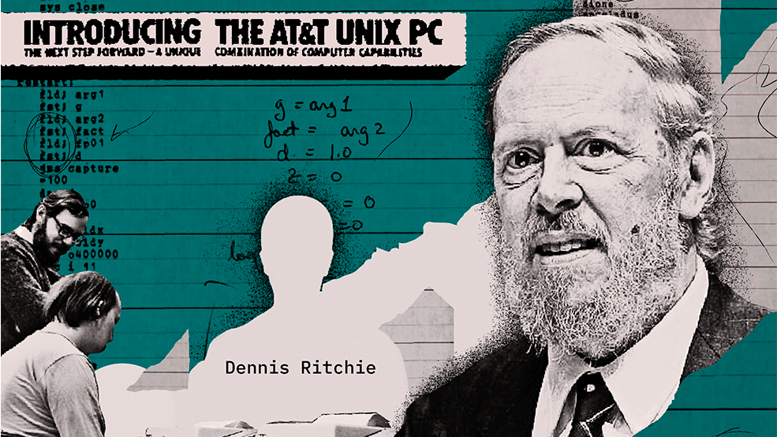

# Dennis Ritchie: the other man inside your iPhone

_The groundbreaking work he did with Ken Thompson led to the operating system behind everything from set-top boxes to the iPhone, but who sings the praises of the late Dennis Ritchie?_

It's funny how fickle fame can be. One week Steve Jobs dies and his death tops the news agendas in dozens of countries. Just over a week later, Dennis Ritchie dies and nobody – except for a few geeks – notices. And yet his work touched the lives of far more people than anything Steve Jobs ever did. In fact if you're reading this online then the chances are that the router which connects you to the internet is running a descendant of the software that Ritchie and his colleague Ken Thompson created in 1969.

The software in question is an operating system called Unix and the record of how it achieved its current unacknowledged dominance is one of the great untold stories of our time. It emerged from Bell Labs – the R&D facility of AT&T, the lightly regulated monopoly that ran the US telehone network for generations. Dennis Ritchie and Ken Thompson were two ferociously bright Bell programmers who had been assigned to work with MIT on the design of an impossibly complex multi-user operating system called Multics. In the end, the plug was pulled on the project, with the result that Bell Labs found itself with two pissed-off hackers on its books. Ritchie and Thompson badly needed a new operating system to provide an environment for their own programming, had hoped that Multics would provide it and had greatly enjoyed working on the project. Back in the lab they decided that they would just have to build the operating system themselves. So in a fantastic burst of creativity (and without asking anyone's permission) they wrote Unics (as a counterpart to Multics). Inevitably the 'cs' became 'x' and Unix was born.

Thus did AT&T find itself the astonished proprietor of a uniquely powerful and innovative operating system. The problem was that it couldn't sell it, because under the Consent Decree that gave it the telephone monopoly AT&T was not allowed to be in the computer business. So the researchers in Bell Labs did what geeks do – they gave it away to their peers in university research labs, under a licence that permitted the recipients to modify and improve it. In doing this Ritchie and Thompson unwittingly launched the academic discipline of computer science, because university departments were suddenly able to give their students software that was not only powerful (and malleable) but also free. The result was that virtually every computer science student in the world became a Unix geek in the course of his or her education. Unix was to computer science what the Bible is to divinity students. The difference was that geeks were free to modify and improve their bible – which is what Bill Joy and his fellow students at Berkeley did when they created their own version of Unix, codenamed BSD (for Berkeley Software Distribution) – of which more in a moment.

In due course, AT&T escaped the shackles of the Consent Decree and started to assert proprietary rights over Unix. This spurred an MIT programmer named Richard Stallman to embark on a project to change the world. He founded the free software movement, invented a clever way of using copyright law to preserve the freedom of programmers to modify software, and embarked on the GNU project to create a functional clone of Unix that would be free of proprietary constraints. (GNU stands for "Gnu's not Unix" which is the kind of recursive joke only programmers enjoy.) Stallman, who is one of the great figures of our time, built most of the software tools needed for his great project, but before he could write the kernel of the operating system a Finnish hacker named Linus Torvalds did it – and released it in 1991 as Linux.

The rest, as they say, is history. Linux became one of the greatest collaborative ventures the world has seen (second only to Wikipedia), in which geographically dispersed programmers collaborate over the internet to debug, improve, extend and enhance a complex operating system that is not only remarkably stable and reliable but is also free. Because it's free and malleable, every manufacturer in the world who needs a stable and flexible operating system to run an electronic device tends to use Linux – which is how your TV's set-top box and your broadband router and maybe also your smartphone comes to be a Linux box. The same goes for the millions of PCs that make up Google's server farms. In that sense, we are all now Linux (and, by inference, Unix) users.

The neatest twist of all, however, involves Apple. OS X – the operating system that now powers every Apple product – is actually built on the Berkeley distribution of Unix, so if you hack into your iPhone what you'll find is BSD 4.2. You could say, therefore, that what Apple really did was to give Unix a pretty face. I've often wondered what Dennis Ritchie would have made of that. Now that he's gone, we'll never know. What we do know, though, is that we owe him more than we realised.
