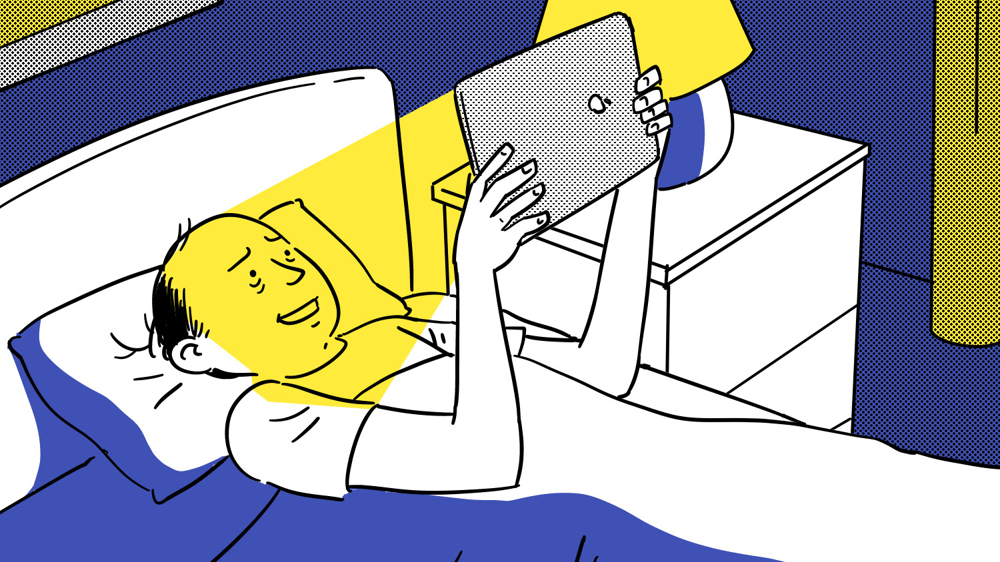

# How the internet is transforming the novel

_Doom scrolling, oversharing, constantly updating social media feeds – the internet shapes how we see the world, and now it’s changing the stories we tell, writes author Olivia Sudjic_

Towards the end of 2020, a year spent supine on my sofa consuming endless internet like a force-fed goose, I managed to finish a beautifully written debut novel: Open Water by Caleb Azumah Nelson, which comes out next month. And yet despite the entrancing descriptions, I could barely turn two pages before my hand moved reflexively toward the cracked screen of my phone. Each time I returned to the novel I felt ashamed, and the shame only grew as I realised that, somehow, though the story was set in the present, and involved an often long-distance romance between two young people with phones, it contained not one single reference to what by then I considered a hallmark of present-day humanity: mindless scrolling through social media.

> The “personality” we think of as our own is being determined by algorithm and then harvested for data

There was something sepia-toned about the book thanks to this absence, recalling love stories from previous eras even as it spoke powerfully to more urgent contemporary issues. Azumah Nelson’s narrator mentions phones in the context of calls and private text messages, but the characters are never sullied by association with Facebook, Twitter or Instagram. Was this because they were too sensible, ethical or self-assured to use such things, or is the omnipresence of these platforms now so implicit, in literature as in life, that they hardly seemed worth mentioning?

After an initial froideur, followed by some adolescent fumblings, fiction’s embrace of social media has now fully come of age. The success of outliers such as Tao Lin’s Taipei (in which the internet is perhaps the most potent of all the many drugs its protagonists ingest) and Dave Eggers’s The Circle (a dystopian exploration of big tech’s assault on privacy), both published in 2013, paved the way for Jarett Kobek’s I Hate the Internet, which riffed on the way the internet perplexes the literary novel, 2017’s Sympathy (my debut, about the ways our identity and actions are shaped by surveillance in the internet age), 2018’s Twitter refreshing Crudo by Olivia Laing, and Matthew Sperling’s aptly named 2020 novel Viral, a satirical takedown of a social media startup.

It’s clear that the digital colonisation of the literary world has not resulted in its predicted death, but an exciting evolution. We are hungry for writers who can parse our present, whether in essay form, in works such as Jia Tolentino’s collection Trick Mirror (2019) and Legacy Russell’s Glitch Feminism: A Manifesto (2020) or the fiction about to hit our shelves (or Kindle screens) that put social media front and centre.
